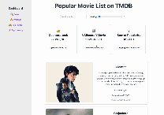

# Web Development Project 6 - *Movie Dashboard*

Submitted by: **Yu-Chi Mei**

This web app: **Fetch the art data from** [TMDB](https://www.themoviedb.org/) 

Time spent: **5** hours spent in total

## Required Features

- [x] The site has a dashboard displaying a list of data fetched using an API call
  - The dashboard should display at least 10 unique items, one per row
  - The dashboard includes at least two features in each row

- [x] useEffect React hook and async/await are used

- [x] The app dashboard includes at least three summary statistics about the data
  - The app dashboard includes at least three summary statistics about the data, such as:
    - the total number of items in the dataset or which meet certain criteria in the dataset
    - the mean, median, mode, or other statistic of a certain aspect of the data
    - quartiles, quintiles, or ranges of the data

- [x] A search bar allows the user to search for an item in the fetched data
  - The search bar correctly filters items in the list, only displaying items matching the search query
  - The list of results dynamically updates as the user types into the search bar

- [x] An additional filter allows the user to restrict displayed items by specified categories
  - The filter restricts items in the list using a different attribute than the search bar
  - The filter correctly filters items in the list, only displaying items matching the filter attribute in the dashboard
  - The dashboard list dynamically updates as the user adjusts the filter

## Stretch Features

- [x] Multiple filters can be applied simultaneously
- [x] Filters use different input types
- [ ] The user can enter specific bounds for filter values (Not sure what does this mean.)

## Video Walkthrough

Here's a walkthrough of implemented required features:

GIF created with [Ezgif](https://ezgif.com/maker)
